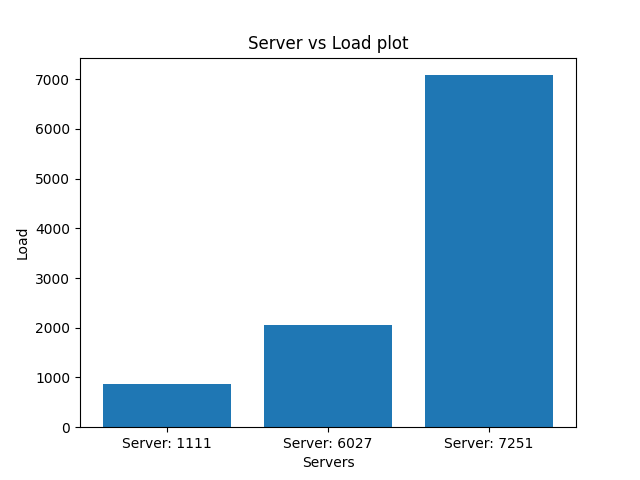
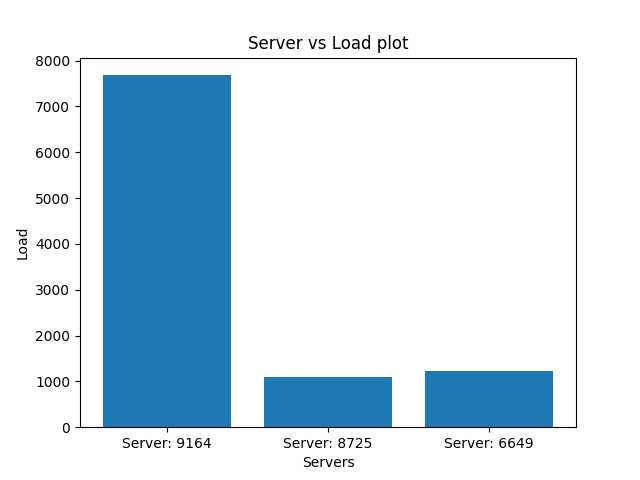
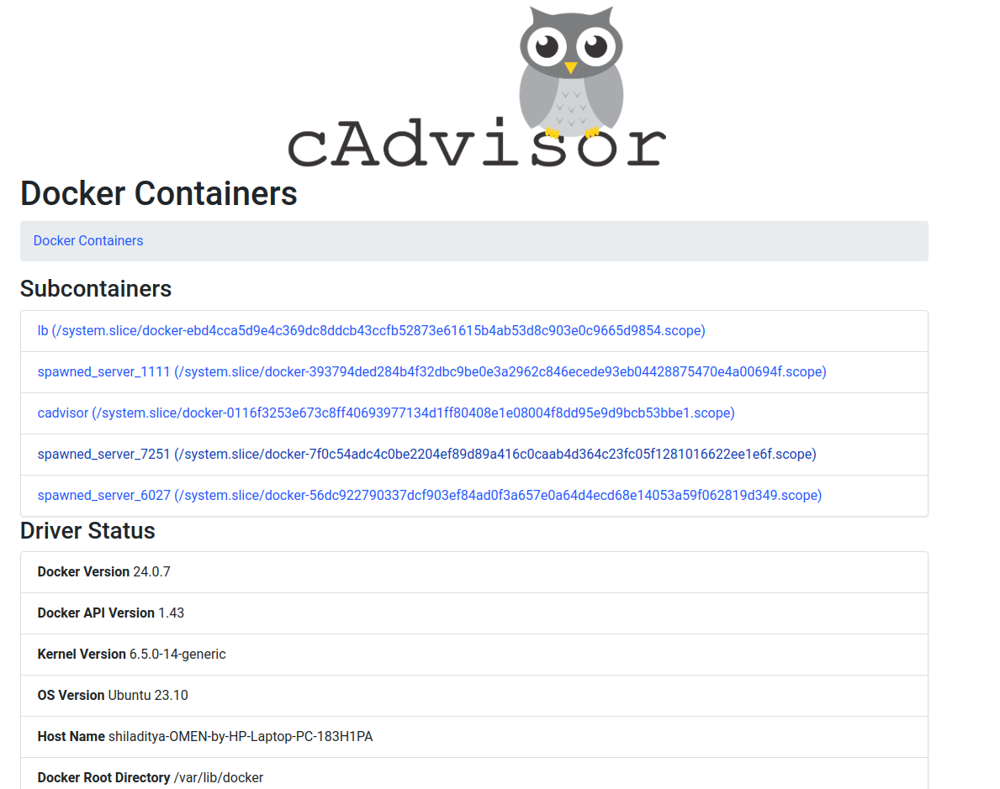

# <div align="center">Customizable Load Balancer</div>

> Assignment 1 of Distributed Systems course (CS60002) offered in Spring semester 2024, Department of CSE, IIT Kharagpur.

<!-- PROJECT LOGO -->
<div align="center">
  <p align="center">
    <br />
    
    
    
    
    <br />
    <br />
    <a href="https://github.com/outer-rim/Query-Optimiser/issues">Report Bug</a>
    ·
    <a href="https://github.com/outer-rim/Query-Optimiser/issues">Request Feature</a>
  </p>
</div>


# About The Project

This project is an implementation of a customizable dynamic load balancer in Go that utilizes consistent hashing. The problem statement can be viewed [here](./DS_assign1_LB_2024.pdf).

Team Members:
- Kartik Pontula (20CS10031)
- Prakhar Singh (20CS10045)
- Shiladitya De (20CS30061)
- Sourabh Soumyakanta Das (20CS30051)

<!-- <p align="right">(<a href="#top">back to top</a>)</p> -->


<!-- INSTALLATION -->
# Getting Started
## Requirements:
- **OS**: Ubuntu 20.04 LTS or later
- **Docker**: Version 20.10.23 or later

## Installation

### 1. **Clone the repository and navigate to the A1 directory.**
```sh
git clone https://github.com/Kronos-192081/DistSys-Spr24.git && cd A1
```
### 2. **Build the Docker images for the load balancer and servers.**
```sh
make build
```
This requires an active internet connection. The generated images can be viewed with `docker images`:
```sh
REPOSITORY                 TAG       IMAGE ID       CREATED          SIZE
lb                         latest    d62b10df29ff   17 minutes ago   10.9MB
server                     latest    b2c8134fdacd   4 hours ago      7.86MB
```
### 3. **Start the load balancer system.**
<b>Note: </b> Use ``sudo`` if necessary
```sh
make run
```
The load balancer shall now be listening on http://localhost:5000/ with 3 servers in the same Docker bridge network `net1`.

One may inspect the containers by running `docker ps` which shows:

```sh
CONTAINER ID   IMAGE     COMMAND            CREATED              STATUS              PORTS                    NAMES
6d174d73c59e   server    "/docker-server"   About a minute ago   Up About a minute   5000/tcp                 Server_3
600e45c760cb   server    "/docker-server"   About a minute ago   Up About a minute   5000/tcp                 Server_2
516f94e95d72   server    "/docker-server"   About a minute ago   Up About a minute   5000/tcp                 Server_1
ca3c268f4e09   lb        "/docker-lb"       About a minute ago   Up About a minute   0.0.0.0:5000->5000/tcp   lb
```

### 4. **Interact with the load balancer.**

One may use a browser, `curl` or other methods to send HTTP requests to the `/home`, `/heartbeat`, `/rep`, `/add` and `/rm` routes on the load balancer as elaborated upon in the problem statement.

#### An Example

```sh
$ curl -vv -X GET http://localhost:5000/home
Note: Unnecessary use of -X or --request, GET is already inferred.
*   Trying 127.0.0.1:5000...
* Connected to localhost (127.0.0.1) port 5000 (#0)
> GET /home HTTP/1.1
> Host: localhost:5000
> User-Agent: curl/7.81.0
> Accept: */*
> 
* Mark bundle as not supporting multiuse
< HTTP/1.1 200 OK
< Date: Wed, 24 Jan 2024 17:19:14 GMT
< Content-Length: 59
< Content-Type: text/plain; charset=utf-8
< 
* Connection #0 to host localhost left intact
{"message":"Hello from Server: 4727","status":"successful"}
```
More elaborate tests can be found in the [Load Balancer Performance Analysis](#load-balancer-performance-analysis) section.


### 5. **Perform testing and analysis.**

One may also send 10,000 asynchronous HTTP requests via the script in the [Analysis](./Analysis/) folder by running this:

```sh
make test
```
Server load analysis will be generated in [./Analysis/A1.png](./Analysis/A1.png) and [./Analysis/A2.png](./Analysis/A2.png).

### 6. **Shutdown and cleanup.**

To stop the servers, load balancer and Docker network:

```sh
make kill
```
To remove the images:
```sh
make clean
```


# Server Implementation

## 1. Overview

- Implemented in Go using the Echo web framework.
- Designed for simplicity with two main endpoints: `/home` and `/heartbeat`.

## 2. Functional Endpoints

### a. `/home`

- **Method:** GET
- **Description:** Returns a JSON response with a greeting message and server number from the `SERVER_NUMBER` environment variable (defaulting to an empty string).
- **Example Response:** `{ "message": "Hello from Server [ID]", "status": "successful" }`

### b. `/heartbeat`

- **Method:** GET
- **Description:** Health check endpoint returning a 200 OK response with no content.

## 3. Middleware

- Logger Middleware: Logs incoming requests and their details.
- Recover Middleware: Recovers from panics during request handling.

## 4. Configuration

- Environment Variables:
  - `PORT`: HTTP port on which the server listens (default: `5000`).
  - `SERVER_NUMBER`: Server number for the `/home` endpoint response (default: empty string).

## 5. Dockerfile Explanation

###  Build Stage:

- **FROM golang:latest AS build:**
  - Uses the official Golang image as the base image for the build stage.

- **WORKDIR /server:**
  - Sets the working directory to `/server`.

- **COPY go.mod go.sum ./ :**
  - Copies the Go module files to the working directory.

- **RUN go mod download:**
  - Downloads the Go modules.

- **COPY &nbsp; \*.go ./ :**
  - Copies the Go source code to the working directory.

- **RUN CGO_ENABLED=0 GOOS=linux go build -o /docker-server:**
  - Builds the Go application with cross-compilation for Linux, disabling CGO, and outputs the executable as `/docker-server`.

### Deployment Stage:

- **FROM scratch AS deploy:**
  - Uses an empty scratch image as the base image for the deployment stage.

- **WORKDIR /server:**
  - Sets the working directory to `/server`.

- **COPY --from=build /docker-server /docker-server:**
  - Copies the built executable from the build stage to the deployment stage.

- **EXPOSE 5000:**
  - Exposes port 5000 for external connections.

- **ENTRYPOINT ["/docker-server"]:**
  - Sets the entry point for the container to run the `/docker-server` executable.

This Dockerfile follows a multi-stage build approach, optimizing the final image size by using a minimal scratch image for deployment. It first builds the Go application in one stage and then copies only the necessary artifacts to the final deployment image. The resulting container is lightweight and contains only the compiled executable and minimal dependencies.


# Consistent Hashing Implementation

## Overview

- Consistent hashing is implemented in Go using a custom `ConHash` structure.
- The implementation includes functionalities to add servers, remove servers, and allocate servers based on client IDs.
- Implemented as a go module which can be imported.

## Data Structures

### 1. Node

- Represents a node in the `ConHash` structure.
- Has two attributes:
  - `Occ` (Occupancy): Indicates whether the node is occupied or not.
  - `Name`: Represents the name of the server.

### 2. ConHash

- Consistent hashing structure.
- Attributes:
  - `HashD`: Array of nodes representing the hash ring.
  - `Size`: Size of the hash ring.
  - `VirtServ`: Number of virtual servers per physical server.
  - `Nserv`: Number of servers in the hash ring.
  - `AllServers`: Map to track all server names.
  - `ServerID`: Map to track server IDs.

## Functional Endpoints

### 1. Add Servers

- **Method:** `Add(ids []int, Names []string) int`
  - Adds servers to the consistent hash ring.
  - Takes an array of server IDs and corresponding names.
  - Checks for name uniqueness.
  - Checks if the size limit is exceeded.
  - Returns 1 on success, 0 on failure.

### 2. Get Configuration

- **Method:** `GetConfig()`
  - Prints the configuration of the consistent hash ring.
  - Displays index, status, and server information.

### 3. Add Single Server

- **Method:** `AddServer(id int, Name string) int`
  - Adds a single server to the consistent hash ring.
  - Checks for name uniqueness.
  - Checks if the size limit is exceeded.
  - Returns 1 on success, 0 on failure.

### 4. Remove Server

- **Method:** `RemoveServer(Name string) int`
  - Removes a server from the consistent hash ring.
  - Returns 1 on success, 0 on failure.

### 5. Get Server Allocation

- **Method:** `GetServer(id int) string`
  - Returns the server for the given client ID.
  - Handles the case of no allocable server.
  - Prints the hash for the given client ID.

## Usage

- Initialize a new `ConHash` instance using `NewConHash(m, k)` with the desired size and virtual servers.
- Use the provided methods to interact with the consistent hash ring.

## Example

```go
package main

import (
    "fmt"
    "prakhar/conhash"
)

// Create a new ConHash instance
ch := conhash.NewConHash(100, 3)

// Add servers to the hash ring
ch.Add([]int{1, 2, 3}, []string{"server1", "server2", "server3"})

// Get and print the configuration
ch.GetConfig()

// Add a single server
ch.AddServer(4, "server4")

// Remove a server
ch.RemoveServer("server2")

// Get server allocation for a client ID
server := ch.GetServer(123)
fmt.Println("Allocated Server:", server)
```

# Load Balancer Implementation

### Environment Variables

3 environment variables are used, namely, `num_serv` which is the initial number of servers which are to be spawned, `num_slots` which is the number of slots in the conhash, `num_virt_serv` which is the number of virtual servers that are to be maintained for each server.

## Initialization

- `num_serv` number of servers are spawned.
- `rep` handler for handling GET requests to \rep
- `add` handler for handling POST requests to \add
- `rm` handler for handling DELETE requests to \rm
- `path` handler for handling all other requests out of which only GET requests to \home and \heartbeat are processed

## Data Structures used

### ServDetails
- It stores the details of servers which are to be sent to the client.
- Attributes
  - `N` : Number of servers currently active
  - `Replicas` : The names of servers currently active

### Payload
- It stores the details of the request sent by the client for processing.
- Attributes
  - `N` : Number of modifications to servers
  - `Hostnames` : Names of servers that need modification, i.e., addition or removal

### ResponseSuccess
- It stores the complete response that is to be sent to the client in case of requests involving server details.
- Attributes
  - `Message` : The server details (struct ServDetails) that are to be sent to the client.
  - `Status` : Status of the response for the request sent by the client.

### Response
- It stores the details of message received during request to server at \home and \heartbeat.
- Attributes
  - `Message` : The message from the server that is to be sent to the client.
  - `Status` : Status of the response for the request sent by the client.

## Utility functions

### GenerateRandomString : num int => string
- It generates the random server name that is necessary during extra server addition from the `num` that is provided as input.

### permuteSlice : slice []string
- It permutes the string array of names `slice` randomly using Fisher-Yates algorithm, which is necessary during random extra server deletion.

### GetServerName => string
- It obtains and returns the server name from a randomly generated id.

### serverHeartbeat => (string, error)
- It performs heartbeat to a random server on `PORT 5000`.
- If the server is found to be unavailable, it tries to add a new server in a loop so as to maintain the the count of active servers and also prevent any server name collisions, and removes the inactive server from conhash.
- If the server is available, it returns the `url` of that server.
- Max Tries has been set to 10000 so as not to loop infinitely in case of errors.

## Docker API functions

### 1. listServerContainers => ([]string, error)
- It runs a new Docker client which lists all active docker containers.
- Only those containers are considered which are present in the docker network `net1`.

### 2. addServerContainer : serverName string, serverNumber int => error
- It runs a new Docker client which tries to add a new docker container with the given `serverName` and sets the environment variable for the container `SERVER_NUMBER` as the given`serverNumber`.
- Additionally, it also adds the server to the conhash data structure.

### 3. killServerContainer : serverName string => error
- It runs a new Docker client which tries to kill the docker container with the given `serverName`.
- Additionally, it also removes the server from the conhash data structure.

## `rep` handler function
- Handles only `GET` requests to \rep
- Uses `listServerContainers()` to get the list of active docker containers.
- Stores the details in the `ServDetails struct` and packs that within the `ResponseSuccess struct` and sends to the client with a status OK.
- All other errors are handled as Internal Server errors.

## `add` handler function
- Handles only `POST` requests to \add
- Receives the client request in a `Payload struct`
- Adds the required servers
- Error in case server is already present
- Extra servers are added with randomly generated names with name collision prevention
- Uses `listServerContainers()` to get the list of active docker containers.
- Stores the details in the `ServDetails struct` and packs that within the `ResponseSuccess struct` and sends to the client with a status OK.
- All other errors are handled as Internal Server errors.

## `rm` handler function
- Handles only `DELETE` requests to \rm
- Receives the client request in a `Payload struct`
- Removes the required servers
- Error in case server is absent
- Extra servers are deleted randomly using the `permuteSlice()` which takes the server name list as input from `listServerContainers()`
- Uses `listServerContainers()` again to get the list of active docker containers.
- Stores the details in the `ServDetails struct` and packs that within the `ResponseSuccess struct` and sends to the client with a status OK.
- All other errors are handled as Internal Server errors.

## `path` handler function
- Handles only `GET` requests on the path \home and \heartbeat
- It performs `serverHeartbeat` which returns a successful url.
- Th response is packed in a `Response struct` with status code OK and sent to the client.
- All other errors are handled as Internal Server errors.

# Load Balancer Performance Analysis

This document presents an analysis of the load balancer's performance based on the Python script provided. The script launches asynchronous requests to the load balancer under different scenarios and gathers metrics for load distribution and scalability.

## Experiment A-1: Load Distribution with N = 3

### Test Description:

- Send 10,000 asynchronous requests to a load balancer with N = 3 server containers.
- Report the request count handled by each server instance in a bar chart.

### Results:

**Bar Chart:** 



**Overall Metrics:**

- Time taken: 3 seconds (average)
- Memory usage: 2.5 GB

**Observations:**

- We can see that the distribution of load is very much skewed.

**Conclusion:**
- This is due to the inability of the hash function to produce random numbers, i.e. it is not a pseudo random number generator (PRNG).

---

## Experiment A-2: Scalability with Incrementing N

### Test Description:

- Increment N from 2 to 6 and launch 10,000 requests on each increment.
- Report the average load of the servers at each run in a line chart.

### Results:

**Line Chart:** 


**Overall Metrics:**

- Time taken: 20 seconds (average)
- Memory usage: 2.5 GB

**Observations:**

- We can see that the average load follows the function $\frac{10000}{N}$. 
- However, in such case standard deviation tells a lot about the distribution. In this case for $N = 5$ we get the minimum value which tells that for $N = 5$, the distribution is almost uniform. 

**Conclusions:**

 - From the line chart we can infer that on increasing the number of servers the uniformity of the distribution improves.

---

## Experiment A-3: Endpoint Testing and Server Restoration

### Test Description:

- Send the appropriate HTTP requests to all relevant endpoints.
- Demonstrate server restoration upon server failure.

### Results:

#### `/home`

Request:

```HTTP
GET /home HTTP/1.1
Host: localhost:5000
User-Agent: curl/7.81.0
Accept: */*
```

Response:

```HTTP
HTTP/1.1 200 OK
Date: Wed, 24 Jan 2024 17:19:14 GMT
Content-Length: 59
Content-Type: text/plain; charset=utf-8

{"message":"Hello from Server: 4727","status":"successful"}
```
(Here 4727 is a random server ID assigned by the load balancer.)

#### `/heartbeat`

Response:

```HTTP
HTTP/1.1 200 OK
Date: Wed, 24 Jan 2024 17:20:29 GMT
Content-Length: 0
```

#### `/rep`

Request:

```HTTP
GET /rep HTTP/1.1
Host: localhost:5000
User-Agent: curl/7.81.0
Accept: */*
```

Response:

```HTTP
HTTP/1.1 200 OK
Content-Type: application/json
Date: Wed, 24 Jan 2024 17:35:35 GMT
Content-Length: 87

{"message":{"N":3,"replicas":["Server_3","Server_2","Server_1"]},"status":"successful"}
```

#### `/add`

Request with `n == hostnames.length`:

```HTTP
POST /add HTTP/1.1
Host: localhost:5000
User-Agent: curl/7.81.0
Accept: */*
Content-Type: application/json
Content-Length: 57

{"n":3, "hostnames":["Server_4", "Server_5", "Server_6"]}
```

Response:

```HTTP
HTTP/1.1 200 OK
Content-Type: application/json
Date: Wed, 24 Jan 2024 17:25:12 GMT
Content-Length: 120

{"message":{"N":6,"replicas":["Server_6","Server_5","Server_4","Server_3","Server_2","Server_1"]},"status":"successful"}
```

Request with `n > hostnames.length`:

```HTTP
POST /add HTTP/1.1
Host: localhost:5000
User-Agent: curl/7.81.0
Accept: */*
Content-Type: application/json
Content-Length: 33

{"n":2, "hostnames":["Server_7"]}
```

Response:

```HTTP
HTTP/1.1 200 OK
Content-Type: application/json
Date: Wed, 24 Jan 2024 17:25:12 GMT
Content-Length: 153

{"message":{"N":8,"replicas":["spawned_server_7135","Server_7","Server_6","Server_5","Server_4","Server_3","Server_2","Server_1"]},"status":"successful"}
```

Request with `n < hostnames.length`:

```HTTP
POST /add HTTP/1.1
Host: localhost:5000
User-Agent: curl/7.81.0
Accept: */*
Content-Type: application/json
Content-Length: 45

{"n":1, "hostnames":["Server_8", "Server_9"]}
```

Response:

```HTTP
HTTP/1.1 400 Bad Request
Content-Type: application/json
Date: Wed, 24 Jan 2024 18:06:34 GMT
Content-Length: 98

{"message":"ERROR: Length of hostname list is more than newly added instances","status":"failure"}
```

#### `/rm`

Request with `n == hostnames.length`:

```HTTP
DELETE /rm HTTP/1.1
Host: localhost:5000
User-Agent: curl/7.81.0
Accept: */*
Content-Type: application/json
Content-Length: 45

{"n":2, "hostnames":["Server_3", "Server_2"]}
```

Response:

```HTTP
HTTP/1.1 200 OK
Content-Type: application/json
Date: Wed, 24 Jan 2024 17:32:42 GMT
Content-Length: 131

{"message":{"N":6,"replicas":["spawned_server_7135","Server_7","Server_6","Server_5","Server_4","Server_1"]},"status":"successful"}
```

Request with `n > hostnames.length`:

```HTTP
DELETE /rm HTTP/1.1
Host: localhost:5000
User-Agent: curl/7.81.0
Accept: */*
Content-Type: application/json
Content-Length: 45

{"n":3, "hostnames":["Server_1", "Server_4"]}
```

Response:

```HTTP
HTTP/1.1 200 OK
Content-Type: application/json
Date: Wed, 24 Jan 2024 17:32:42 GMT
Content-Length: 109

{"message":{"N":4,"replicas":["spawned_server_7135","Server_7","Server_6","Server_5"]},"status":"successful"}
```

Request with `n < hostnames.length`:

```HTTP
DELETE /rm HTTP/1.1
Host: localhost:5000
User-Agent: curl/7.81.0
Accept: */*
Content-Type: application/json
Content-Length: 45

{"n":1, "hostnames":["Server_6", "Server_7"]}
```

Response:

```HTTP
HTTP/1.1 400 Bad Request
Content-Type: application/json
Date: Wed, 24 Jan 2024 18:16:20 GMT
Content-Length: 98

{"message":"ERROR: Length of hostname list is more than newly added instances","status":"failure"}
```

#### `/other`

Request:

```HTTP
GET /foobar HTTP/1.1
Host: localhost:5000
User-Agent: curl/7.81.0
Accept: */*
```

Response:

```HTTP
HTTP/1.1 400 Bad Request
Content-Type: application/json
Date: Wed, 24 Jan 2024 18:17:47 GMT
Content-Length: 91

{"message":"ERROR: '/other' endpoint does not exist in server replicas","status":"failure"}
```

## Modifying the Hash functions $H(i) $ and $\phi(i, j)$
### Modified Hash function 1:-
$$
H(i) = i^2 + 2i + 17
$$

$$
\phi(i, j) = i^2 + j^2 + 2j + 25
$$


### Modified Hash function 2:-
$$
H(i) = i^2 + 7i + 31
$$

$$
\phi(i, j) = i^2 + j^2 + i + j - (i | j) + ((i>>4) \oplus (j >> 3))
$$


### Modified Hash function 3:-
$$
H(i) = sha256sum(i)(mod 512)
$$

$$
\phi(i, j) = sha256sum(i|j)(mod 512)
$$




# Monitoring Docker Containers with cAdvisor
cAdvisor helps to monitor the docker containers in the form of a GUI. It tracks the memory, CPU and Network usage of docker containers.

Run ``make monitor`` to use it in ``http://localhost:8080``.

## Sample images:
### Homepage




### Servers
#### CPU Usage


### Load Balancer
#### CPU and Memory Usage


#### Network

